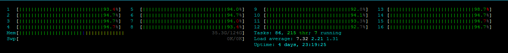
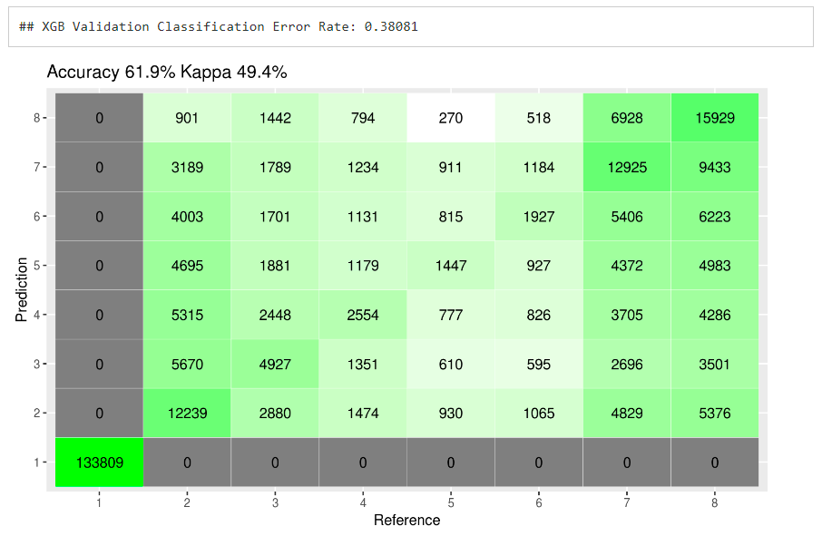

# Customer-Visits
The data-set provides information about shopping mall visits of 300k customers over the course of 143 weeks. Each line represents one customer - the first column contains a unique customer identifier and the second column contains a vector of the day numbers he/she visited the mall. 

The day with index 1 is a Monday (7 is a Sunday, 8 is again a Monday). Indices are within a range of 1 to 1001 (which is equal to 143 full weeks). The task is to predict the first day of the next visit (in week 144). 

For instance, if a customer will visit the mall on a Wednesday, then the model should predict 3. 

# Remarks
This problem is interesting since the crux of the exercise is feature engineering. The journey of taking the problem from 

to

Secondly, when you do the above, the data set becomes extremely heavy. Making use of your hardware to the max is important.

Folks looking at how it performed, here's a screengrab of the confusion matrix.

